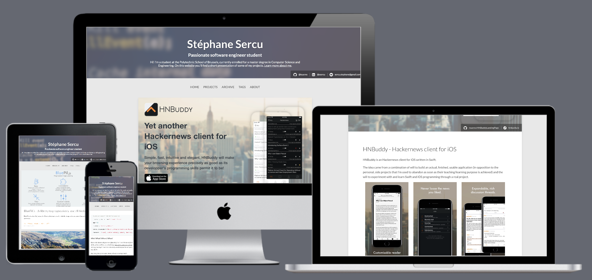

## Portfolio

[](http://tsucres.me)


This repo hosts my portfolio. It's a jekyll based static website accessible [here](http://www.tsucres.me).

The design is inspired by the two following themes: 
- [Clean+Simple](https://github.com/nathanrooy/Clean-and-Simple-Jekyll-Theme)
- [HPSTR](https://github.com/mmistakes/hpstr-jekyll-theme)

I also added the following features: 
- Progressive load of feature images using [BluePil.js](https://github.com/tsucres/BluePil.js) (parametrized through the `image` field in the header of the posts)
- External links on top of posts. Those are specified in the liquid header of the posts (`external-links` param).
- Update of the syntactic coloration (see [`_sass/syntax.scss`](_sass/syntax.scss))
- Usage of [jekyll-github-sample](https://github.com/bwillis/jekyll-github-sample) to embed github codes in the posts.
- A neat trick to hide my email address from spam bots (found [here](https://stackoverflow.com/questions/483212/effective-method-to-hide-email-from-spam-bots#answer-41566570))


#### post layout

```md
---
layout: post
title: Title
description: "Description that shows in the post-index."
date-string: DECEMBER 6, 2017
tags: [sample, post]
image:
  feature: full-size-image.jpg
  feature-mini: miniature.jpg
  width: 888
  height: 888
  show-on-top: true/false
external-links: 
  github: username/repo_name
  others: ["https://example.com/path.html", "https://example2.com/path2.html"]
---

## Generic markdown

```

Note that `width` and `height` are only needed if `show-on-top: true` and `feature-mini` is specified (the later is optional).


#### serve

```sh
jekyll serve
```


## Host

The website is hosted on github, on the `master` branch of this repo. The repo is organised according to the method described [here](https://drewsilcock.co.uk/custom-jekyll-plugins).

